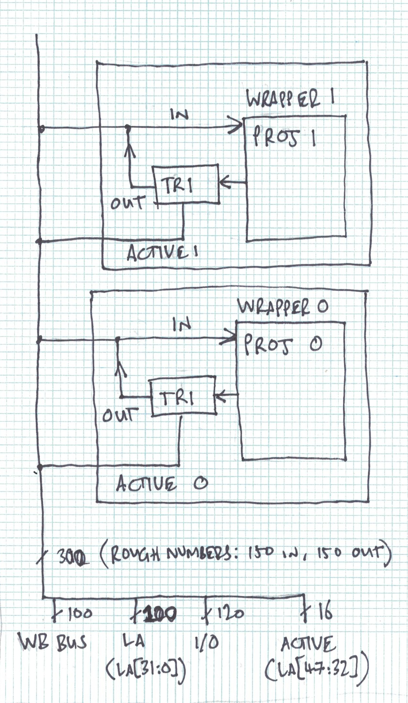
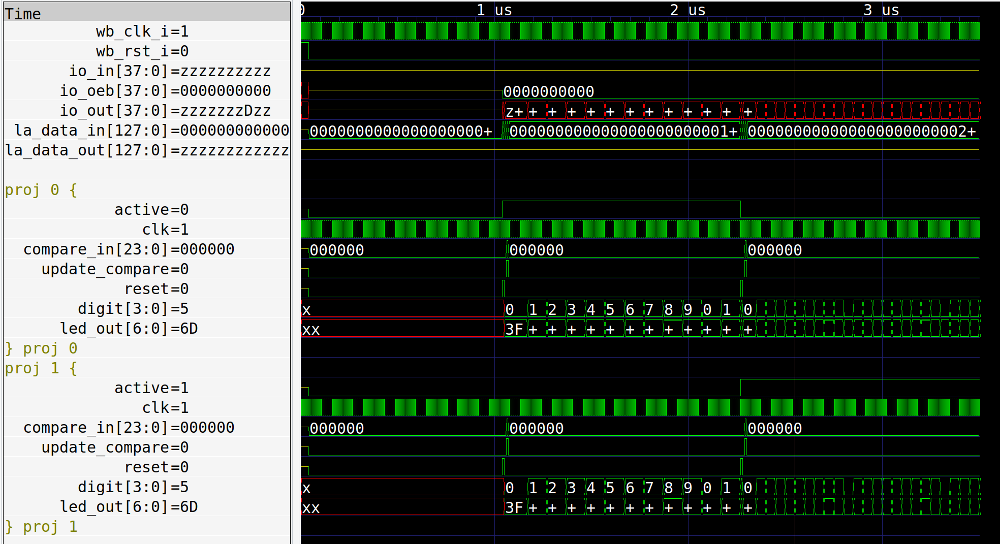
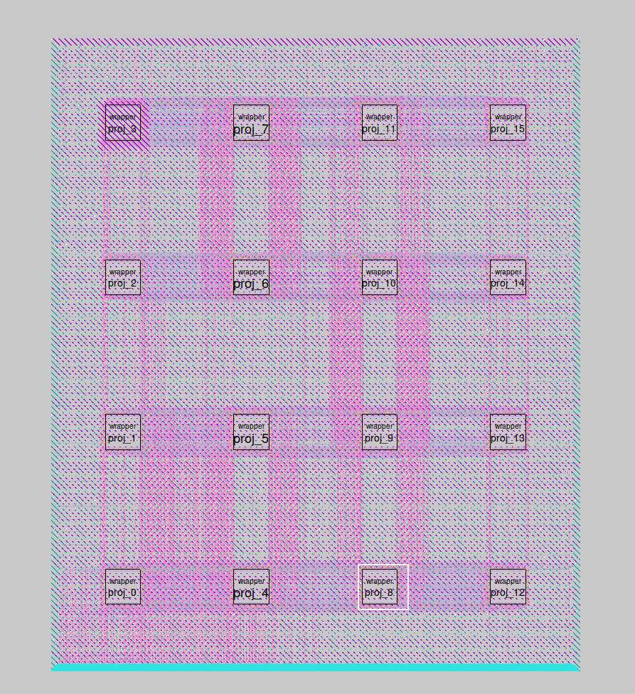
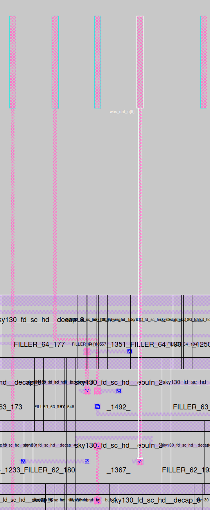

# Multi Project Wrapper v2

## Aim

* Allow many (<20) designers to combine their small design into a single application to the Google/Efabless/Skywater ASIC  shuttle.
* Compartmentalise the designs and allow them to be activated in turn.
* Each design should have access to all the I/O and [Caravel](https://github.com/efabless/caravel) wishbone bus.

## Version 1 issues

* The last version (submitted on first shuttle) used a MUX, which had a star topology. 
* Due to restrictions in the OpenLANE ASIC flow, all the designs had to be instantiated at the top level, then routed out to the MUX, then back to the IO.
* Each design had a different interface that required a unique instantiation. This was pretty ugly and prone to errors. 
* The MUX block had to be long and thin to fit all the pins (~3k) around the edges.

## Improvements

* Unify interface.
* Use bus topology with tristated outputs on each design, reducing routing congestion.
* Formal [proof of tristate](properties.v) that can be run as part of CI.

## Proposal

* Each project gets instantiated inside the [wrapper.v](wrapper.v)
* Wrapper provides unified interface with ~320 pins: all IO, all wishbone, reduced logic analyser (logic analyser is firmware controlled by [caravel harness picorv32](https://github.com/efabless/caravel)).
* Individual wrappers are activated by [logic analyser pins](https://github.com/mattvenn/tristate-test/blob/ee7369ed6f704a73b9106e8bdbadb4eda9e9325b/user_project_wrapper.v#L133) not connected to the wrapper.
* All the wrappers get instantiated by [user_project_wrapper.v](user_project_wrapper.v) (this is part of the Efabless harness and can't be changed.

## Simulation

Simulation shows startup, no design active, 1st design active, 2nd design active.

    make sim # requires cocotb
    gtkwave user_project_wrapper.vcd  user_project_wrapper.gtkw

## OpenLANE Results

Initial results look good. The OpenLANE flow was able to route 16 designs with only a few errors that are currently being investigated.

Picture shows output pin connecting to an ebuf tristate cell.

Yosys [cell usage report](docs/yosys_2.stat.rpt) includes tristate buffers in use for individual wrapper macro.

## To resolve

* [Yosys report](docs/yosys_.chk.rpt) reports multiple conflicting drivers for all the tristated outputs.
* run a gate level simulation

# Design Review

## Ahmed

* tristate hand placed (rather than inferred), to keep mindful, make it explicit
* better include tristate inside macro not outside to keep it the most similar as before
* use rc6 for testing
* cts outside and design uses external slow clock divider module
* ref for handplaced tristate https://github.com/shalan/DFFRAM/blob/main/Handcrafted/Models/DFFRAMBB.v#L205

## tnt

* ditch la, or most of it
* use opendb to do the bus routing and connections?
* esd diodes on inputs + buffers of tri block for protection and isolation
* looks good
